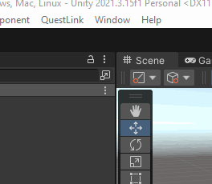

    

<h2 align="center">Quickly start or stop Quest Link on Meta devices via Unity</h2>

### Installation

Download the [latest verson](https://github.com/jemmec/quest-link-automation/releases/latest) of the unity package and add it to your project.

### Android Debug Bridge (adb)

Ensure you have *adb* installed on your system and added to the environment variables path. If you do not have *adb* you can download it from here: https://developer.android.com/tools/releases/platform-tools. Once installed, open a terminal and type `adb version`, the terminal should print the current version of Android Debug Bridge, if it has been installed correctly.
